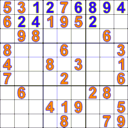

# Sudoku_Solver 	    
Sudoku game is well famous and popular game among many players all over the world. This report details the development of a Sudoku game application that is written in C++.   
In addition, the report details the implementation of the complexity of the algorithms used to solve any kind of Sudoku puzzle. Also, how to generate a puzzle with different level of difficulties and make sure there will be only one solution that appears to be best. 
The aim of the report is also to discuss the backtracking, brute force algorithms and other logics in order to create and solve Sudoku puzzles.  

  
  
## CONCEPT   
The concept used for implementing a Sudoku Solver was Back Tracking which was implemented by recursive functions and the basic constraints that are required for solving a Sudoku. 
 
The first and the best method we came up with is using 2-D Array as the Data Structure in the project to input the values of a Sudoku that are available to the person solving it. 
 
The reason behind going for Array is that it provides CONSTANT TIME ACCESS because of Contagious Integer Indexing.  
 
We also had a look on DFS as well as Doubly Linked List but the output was not as fast as observed in case of 2-D Array it is because of the time complexity of the above two variants. 

## DATA STRUCTURE USED 
We used 2-D Array as the Data Structure for implementing our Sudoku Solver which solves the Sudoku in O(n^n^2) that is Big O of n raise to the power of n squared. 

 
 
 
 
 
 

 
